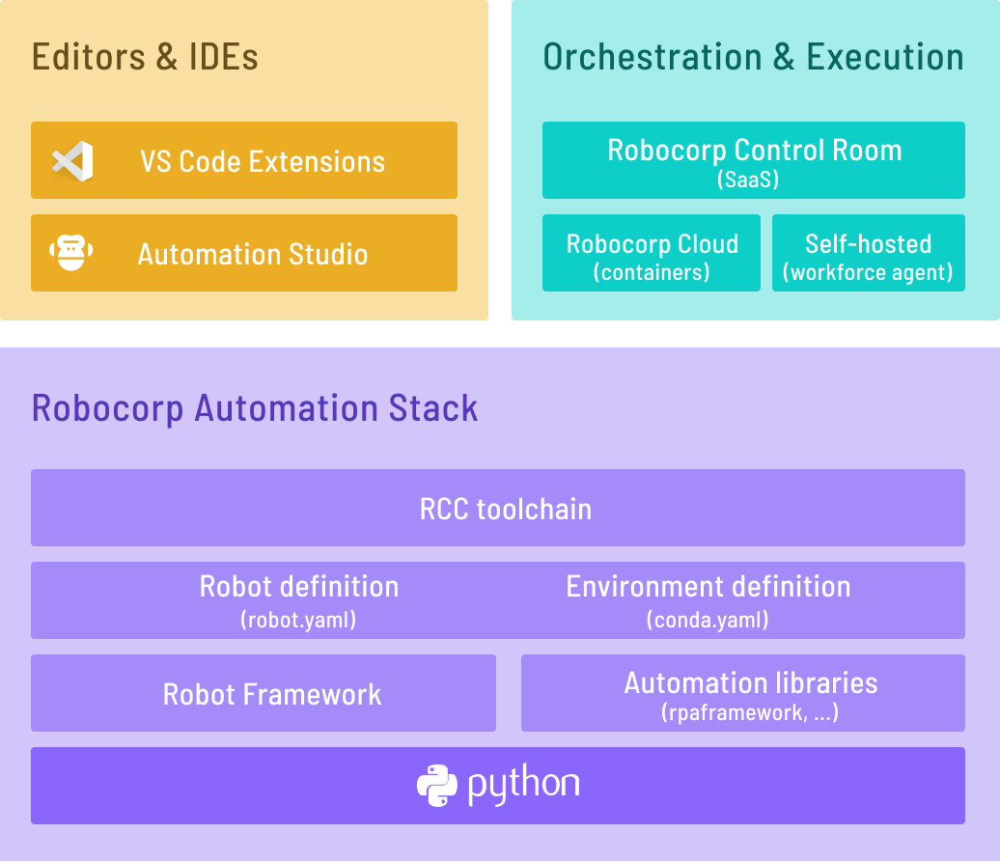

# RCC

[](https://github.com/joshyorko/rcc/actions/workflows/rcc.yaml)
[](https://goreportcard.com/report/github.com/joshyorko/rcc)
[](https://codecov.io/gh/joshyorko/rcc)
[](https://github.com/joshyorko/rcc/releases)


RCC allows you to create, manage, and distribute Python-based self-contained automation packages. RCC also allows you to run your automations in isolated Python environments so they can still access the rest of your machine.

🚀 "Repeatable, movable and isolated Python environments for your automation."

Together with [robot.yaml](https://robocorp.com/docs/robot-structure/robot-yaml-format) configuration file, `rcc` is a foundation that allows anyone to build and share automation easily.

<p align="center">
  
</p>

RCC is actively maintained by [JoshYorko](https://github.com/joshyorko).


## Why use rcc?
 
* You do not need to install Python on the target machine
* You can control exactly which version of Python your automation will run on (..and which pip version is used to resolve dependencies)
* You can avoid `Works on my machine`
* No need for `venv`, `pyenv`, ... tooling and knowledge sharing inside your team.
* Define dependencies in `conda.yaml` and automation config in `robot.yaml` and let RCC do the heavy lifting.
* If you have run into "dependency drifts", where once working runtime environment dependencies get updated and break your production system?, RCC can freeze ALL dependencies, pre-build environments, and more.
* RCC will give you a heads-up if your automations have been leaving behind processes after running.

...and much much more. 

👉 If the command line seems scary, just pick up [Robocorp Code](https://marketplace.visualstudio.com/items?itemName=robocorp.robocorp-code) -extension for VS Code, and you'll get the power of RCC directly in VS Code without worrying about the commands.

## Getting Started

:arrow_double_down: Install rcc 
> [Installation guide](https://github.com/robocorp/rcc?tab=readme-ov-file#installing-rcc-from-the-command-line)

:octocat: Pull robot from GitHub:
> `rcc pull github.com/robocorp/template-python-browser`

:running: Run robot
> `rcc run`

:hatching_chick: Create your own robot from templates
> `rcc create`

For detailed instructions, visit [Robocorp RCC documentation](https://robocorp.com/docs/rcc/overview) to get started. To build `rcc` from this repository, see the [Setup Guide](/docs/BUILD.md)

## Installing RCC from the command line

> Links to changelog and different versions [available here](https://downloads.robocorp.com/rcc/releases/index.html)

### Windows

1. Open the command prompt
1. Download: `curl -o rcc.exe https://downloads.robocorp.com/rcc/releases/latest/windows64/rcc.exe`
1. [Add to system path](https://www.architectryan.com/2018/03/17/add-to-the-path-on-windows-10/): Open Start -> `Edit the system environment variables`
1. Test: `rcc`

### macOS

#### Brew cask from Robocorp tap

1. Update brew: `brew update`
1. Install: `brew install robocorp/tools/rcc`
1. Test: `rcc`

Upgrading: `brew upgrade rcc`

### Linux

1. Open the terminal
1. Download: `curl -o rcc https://downloads.robocorp.com/rcc/releases/latest/linux64/rcc`
1. Make the downloaded file executable: `chmod a+x rcc`
1. Add to path: `sudo mv rcc /usr/local/bin/`
1. Test: `rcc`

## Documentation

Visit [https://robocorp.com/docs](https://robocorp.com/docs) to view the full documentation on the full Robocorp stack.

The changelog can be seen [here](/docs/changelog.md). It is also visible inside RCC using the command `rcc docs changelog`.

[EULA for pre-built distribution.](https://cdn.robocorp.com/legal/Robocorp-EULA-v1.0.pdf)

Some tips, tricks, and recipes can be found [here](/docs/recipes.md).
These are also visible inside RCC using the command: `rcc docs recipes`.

## Telemetry

This fork disables all internal telemetry by default:

- No background metrics are sent and internal metrics are disabled across product modes.
- The installation identifier header is not attached to outbound HTTP requests when telemetry is disabled.
- The `rcc configure identity` output will always report tracking as disabled unless explicitly modified in code; feedback/metric commands are effectively no-ops.

If you depend on Robocorp Control Room features that require telemetry or the installation identifier, adapt the forked code accordingly. The build and asset pipeline remains unchanged.

## Repoint endpoints without code changes

If you want to keep cloud-related commands available but stop referring to Robocorp’s control plane by default, you can repoint all network endpoints via environment variables or a local `settings.yaml`.

- Quick override with environment variables (takes precedence over builtin settings):
  - RCC_ENDPOINT_CLOUD_API
  - RCC_ENDPOINT_CLOUD_LINKING
  - RCC_ENDPOINT_CLOUD_UI
  - RCC_ENDPOINT_DOWNLOADS
  - RCC_ENDPOINT_DOCS
  - RCC_ENDPOINT_TELEMETRY
  - RCC_ENDPOINT_ISSUES
  - RCC_ENDPOINT_PYPI
  - RCC_ENDPOINT_PYPI_TRUSTED
  - RCC_ENDPOINT_CONDA

Example (zsh):

```zsh
# Point rcc at your own control plane endpoints
export RCC_ENDPOINT_CLOUD_API="https://api.control-room.yorko.io/"
export RCC_ENDPOINT_CLOUD_UI="https://console.control-room.yorko.io/"
export RCC_ENDPOINT_CLOUD_LINKING="https://console.control-room.yorko.io/link/"

# Optional: switch where generic downloads (e.g., rcc releases index) resolve
export RCC_ENDPOINT_DOWNLOADS="https://downloads.control-room.yorko.io/"

# Optional mirrors for docs, PyPI, and conda
export RCC_ENDPOINT_DOCS="https://docs.control-room.yorko.io/"
export RCC_ENDPOINT_PYPI="https://pypi.org/simple/"
export RCC_ENDPOINT_PYPI_TRUSTED="https://pypi.org/"
export RCC_ENDPOINT_CONDA="https://conda.anaconda.org/"

# Validate your overrides
build/rcc configuration diagnostics --quick --json | jq .
```

- Local settings file: write a `settings.yaml` to `$(ROBOCORP_HOME)/settings.yaml` with an `endpoints:` section. See `assets/robocorp_settings.yaml` for the full shape; any key you set there will override the built-in defaults.

Notes
- Micromamba is embedded into `rcc` and extracted locally at runtime; no live download is needed. If you rebuild assets yourself, you can change the micromamba download base used during asset preparation via:

```zsh
export RCC_DOWNLOADS_BASE="https://downloads.control-room.yorko.io"
rcc run -r developer/toolkit.yaml --dev -t assets
```

- To verify what endpoints are in effect at runtime, run:

```zsh
build/rcc configuration diagnostics --quick --json | jq .
```

## Community and Support

The Robocorp community can be found on [Developer Slack](https://robocorp-developers.slack.com), where you can ask questions, voice ideas, and share your projects.

## License

Apache 2.0
