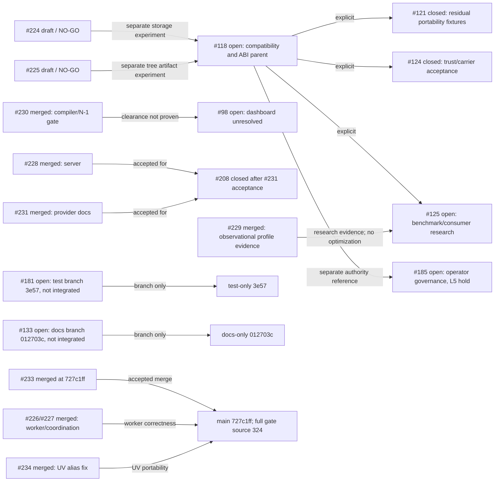

# RCC live inventory and acceptance handoff

Public GitHub snapshot: **2026-10-11 02:34:18 UTC**. Main is `727c1ff8b679cdbbe12836e53c87734a1edb0071`, tree `cfae5c5ee9df0e5031e8e9ae37040b5c98ac6152`, matching the accepted PR #233 source tree. Latest stable/release is v18.19.5; inventory is **10 open issues, 2 open PRs, 70 branches, 33 tags, 27 releases, 0 milestones**. PR #233 merged at 02:29:54Z. No v18.19.6 tag or release was published.

## Open issues

| Issue | Current state and remaining acceptance boundary |
|---|---|
| [#185](https://github.com/joshyorko/rcc/issues/185) | Open. Separate operator governance, L5 hold-gated. No runtime result, branch, label, merge, or release promotes authority to L6. |
| [#182](https://github.com/joshyorko/rcc/issues/182) | Open. Broader journal lifecycle and failure-branch coverage remains. |
| [#181](https://github.com/joshyorko/rcc/issues/181) | Open; body updated 02:19:44Z. Test-only branch `codex/rcc-181-scale-acceptance-20261011` at `3e57fde849398ea69954b4c09d5dad9ca0111361` / tree `76a02d87b2e20543e9b7991fe0db04b9ad2e20f1`; no PR and not integrated. Root unit/race checks passed at 91.2% coverage; worker 20-shuffle run passed. Covers Scale/capacity behavior, queued drain and all-worker panic recovery. Sync wait-entry timing, default CPU/cap branches, closed-pipeline lifecycle and concurrent global WorkerCount mutation remain unproven. Keep open. |
| [#135](https://github.com/joshyorko/rcc/issues/135) | Open. Delta lint is green; baseline findings still need individual disposition. |
| [#133](https://github.com/joshyorko/rcc/issues/133) | Open; body updated 02:32:55Z. Docs-only branch `codex/rcc-133-contributor-map-20261011` at `012703c2474dd8585972edba0695bad4633d9230` / tree `884db3fd157fb540e4d48261d164e36896c20a01` updates four directory rows in `CONTRIBUTING.md`. Root verified tree/readback/diff. No PR and not integrated. |
| [#132](https://github.com/joshyorko/rcc/issues/132) | Open. Import-time initialization remains; no explicit bootstrap/DI boundary. |
| [#131](https://github.com/joshyorko/rcc/issues/131) | Open. Command/operations error-path tests and durable coverage report remain. |
| [#125](https://github.com/joshyorko/rcc/issues/125) | Open. Research only; no materializer optimization selected. Consumer/version evidence is published. |
| [#118](https://github.com/joshyorko/rcc/issues/118) | Open; body updated 02:33:43Z. Compatibility parent with the #185 governance boundary kept separate. Architecture direction is a two-stage ABI gate: preflight plus exact-runtime verification after restoration and before Ready. Real package-specific CPU behavior, Rosetta, transported-path fixtures, and broader ABI/native acceptance remain. |
| [#98](https://github.com/joshyorko/rcc/issues/98) | Open. Private dependency dashboard access is HTTP 403; alert inventory/clearance remains unverified. |

## Open PRs

| PR | State | Remaining boundary |
|---|---|---|
| [#224](https://github.com/joshyorko/rcc/pull/224) | Draft / NO-GO; head `32d51bd00852b003fd0d82050f5fd6d281f362d5` | Historical exact-head Rcc failed. S3, materializer/CLI, integration, persistence/concurrency and platform acceptance gaps remain. |
| [#225](https://github.com/joshyorko/rcc/pull/225) | Draft / NO-GO; head `b24b29fffab4581456a313a240257d681ad744fd` | Historical exact-head Rcc/lint failed. Inode/hardlink, state/concurrency, integration/security and native/full Robot gaps remain. |

PR #233 is merged. Its merge commit is main `727c1ff8b679cdbbe12836e53c87734a1edb0071`; main tree equals accepted source tree `cfae5c5ee9df0e5031e8e9ae37040b5c98ac6152`. Main has four hosted push checks: Rcc **38105340592** and four native-platform jobs are still running; CodeQL **38105340724**, Coverage **38105340564**, and Lint **38105340590** passed. PR Metrics and Quality are not expected on a push. The opt-in full 11-gate check skips on this non-tag main push by design; the successful full gate remains bound to PR source 324.

## Accepted PR #233 release-candidate evidence

PR #233 source `324524fffa4bd0f76c618f9fbb6ede30e733b2ff`, tree `cfae5c5ee9df0e5031e8e9ae37040b5c98ac6152`, was accepted and merged at 02:29:54Z. Root verified six successful PR checks, all four native receipts, the actual published source and merge tree, and the complete hosted release-candidate run **38103534317 / gate 114364186629**. The numeric gate and `tee` exits were both 0; all eleven gates passed. Robot reported 171 PASS / 0 FAIL / 1 expected Windows skip, and coordination reported six scenarios. Six retained source/self-host binaries were rehashed and identified as Go 1.26.9 builds.

The 2 GiB stream test used a 64 KiB buffer; recorded heap delta was 118,752 bytes and is not an RSS measurement. The N-1 archive `9ed01cbfe2463f0f064ab10efaf61e8e48a9c96767e7b6aa0629e4e8295bcb85` was consumed. Root rechecked 5,045 stored and logically closed archive objects with zero identity mismatch. The uploaded pre-acquire `artifactBefore` snapshot was empty. Because the private post-acquire/provisional snapshots were not persisted, root could not independently count the two removed provisional records; the internal numeric-gated validator passed and retained legacy/post-rollback snapshots were checked separately. Preserve that audit boundary without recasting the gate as failed.

Root also verified 12 current-source binary bundle entries built by Go 1.26.9 with clean VCS metadata, and a nine-asset simulation using the real workflow generator and a synthetic v18.19.5 retention index. The simulation was not published. Publisher signature/notarization, version tag and release publication remain separate and unauthorized.

## Main post-merge verification

Root verified main `727c1ff8b679cdbbe12836e53c87734a1edb0071` / tree `cfae5c5ee9df0e5031e8e9ae37040b5c98ac6152`: asset generation exited 0, CGO=1 full Go tests exited 0, and all 116 script tests passed after building the required `build/rcc`. The first script-test attempt exited 1 because it ran before that binary existed; that attempt and log are retained. The actual clean Go 1.26.9 binary is v18.19.6, SHA-256 `daf9143e7caf0fc2dcf59e999396c5168d4148c7d1bae4fa59ccbbe620018998`. Main's 12-binary bundle is staged with Go 1.26.9 and clean VCS metadata; root verification is pending. Do not substitute the PR 324 full-gate receipt for main's push/native workflows.

## Separate unintegrated documentation and test branches

Issue #133's published branch changes only four directory rows in `CONTRIBUTING.md`; root verified the published commit matches reviewed tree `884db3fd157fb540e4d48261d164e36896c20a01`. The doc map is source-checked, but no PR exists and main is unchanged. Issue #181's separate test-only branch has passing unit/race/shuffle evidence but no PR and is not integrated. Neither branch changes the accepted PR #233 tree.

## Compatibility, security and governance limits

The Actions opt-in adapter at immutable `joshyorko/actions` commit `a70993fafc99a9f94041485542d5a720797ca394` accepts only RCC v18.19.3; v18.19.5 and v18.19.6 are rejected. This remains an existing consumer constraint, not a regression finding. No Actions repository state changed.

Strict-consumer proof, four-target security scan, and 17-command provider probe are bound to ancestor 097. Strict verification passed four numeric commands and rehashed 5,049 CAS files against 5,045 indexed objects with no mismatch; refreshed empty revocations were unsigned. The scan had no call-traced findings, but GO-2026-5970 package-level and GO-2026-6629 module-level findings remain. The provider probe confirmed the named-profile explicit-carrier gap on stable and candidate controls. Do not rebind these to main 727.

Historical 097 full-gate attempt exited 1 after eight of eleven gates passed; one failed and two did not run. Historical 680f reported eleven gates passed, but its outer wrapper numeric exit was not preserved. Both are separate source records. Current accepted 324 gate has its own numeric 0/0 receipt.

## Dependency graph

## Root-verified receipt index

| Claim | Receipt path | SHA-256 |
|---|---|---|
| PR #233 full 11-gate exact-source verification, numeric gate/tee 0, Robot, self-host and coordination | `evidence/hosted-full-acceptance/root-independent-full-verification.json` | `1ef9c96dca6e776e49dd73db55636c9de20139309a8e1bb4eeb9c73f6c7049a9` |
| N-1 archive object closure and rollback evidence boundary | `evidence/hosted-full-acceptance/root-archive-closure-current324.json` | `6079f47d36360cfc4a7f781712e4ac22ebeee1ed79fbcde871bb0cf2b4aa20f9` |
| PR merge receipt and actual uploaded artifacts | `evidence/hosted-full-acceptance/root-merge-acceptance-233.json` | `9ad48a5726076b07cd07d8a9c73c8c4bb8d7ce561ac3ff34ebbc7b92d0a0a8ca` |
| Four native receipts, 12 bundle entries and nine-asset simulation | `evidence/hosted-native/pr233-current-324524f/root-native-progress-verification.json`; `root-all-eight-and-native-bundle-verification.json`; `root-distribution-consumer-verification.json` | `69776b371357d9365be3a906046c79843f02253b886ef2426fe2819625a8f48d`; `949572a7a25da3f1151a0557862eec833a31a3cc25eabdd84a6706f87190f2a3`; `3b590d7a1d7917a82e8696b12521fdf36aa101c4b59d0482fbdd044701231232` |
| Post-merge main 727 source/build/script verification | `evidence/final-main-727/root-independent-verification.json` | `4542f65aaaf011c6757d0ff28b7bcb0efbe5f149d3a9cef20de9578554be9f80` |
| #133 published docs-only branch proof | `evidence/issue133-doc-audit-20261011/root-publication-verification.json` | `fd8ee7b4a7265077dc0ccde9fdb41965c0dea4b7513bea642e7e64e6d66e864a` |
| #181 test-only branch publication and unit/race verification | `evidence/issue181-scale-20261011/root-publication-verification.json`; `root-independent-verification.json` | `74b9e4ed4986f07b0d73590cf4f61bd95029836dee05e9b612c6da2e92fc4fe3`; `54a368a60a293b8ab9b8ce5f90a86395f3bafd0514c18294c2bc392bcd62f8e3` |
| Strict 097 trust proof and provider runtime probe (ancestor-only) | `evidence/candidate-09796/strict-trust/root-independent-verification.json`; `evidence/consumer-contract-125-20261011/provider-contract-probe/root-independent-verification.json` | `73660999974864783c0087f341bb2d62d069a9666403de0c20ebf661c60fa0c4`; `8d44067601f698c6c0044cf98a014620a37e5366d32378a4dff6f4d4dd1ceb51` |

## Active lanes

| Lane | Model / effort | Current state |
|---|---|---|
| Root | Sol / High | PR #233 accepted and merged; verifying main push/native checks and staged bundles. |
| `native_acceptance` | Luna / High | PR #233 full gate and four native receipts complete; final-main native/check workflows remain active. |
| `pr_readiness` | Luna / High | #133 contributor-map audit/fix complete; separate branch has no PR. |
| `consumer_contract_125` | Sol / Extra High | Archive/ABI research complete; broad #118 CPU/Rosetta/transport acceptance remains open. |
| `workers_226` | Luna / High | Worker correctness/hosted gate integrated; separate #181 capacity/panic tests complete, with no PR/integration. |
| `identity_118_124` | Luna / High | Strict 097 trust proof complete; source-bound to 097. |
| `performance_125` | Sol / Extra High | Observational evidence complete; no optimization selected. |

No Astra lane was used. #133 and #181 branches remain separate from main and from each other.

Root update through02:38UTC: all12 actual final-main staged bundle entries now pass root byte/digest/compiler/VCS727-clean verification. Current-source distribution simulation and ten CLI help comparisons pass. Using the actual GitHub-digested released v18.19.5 index, the real generator retains19 prior entries unchanged plusv6 under its existing20-entry cap; v5/v3 remain and oldestv18.12.0 drops from the listing. No assets deleted/published. See final-main root receipts in the manifest.
