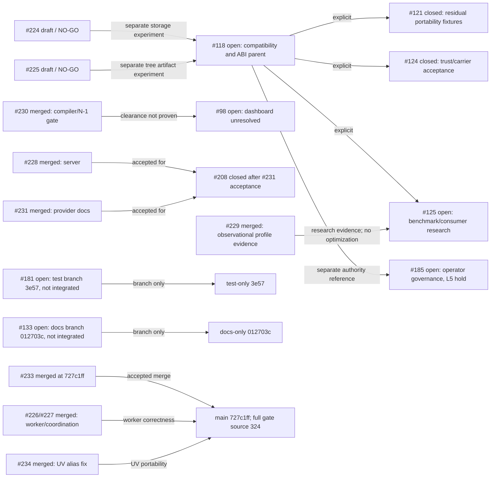

# RCC live inventory and acceptance handoff

Public GitHub snapshot: **2026-10-11 02:51:36 UTC**. Main is `727c1ff8b679cdbbe12836e53c87734a1edb0071`, tree `cfae5c5ee9df0e5031e8e9ae37040b5c98ac6152`, matching the accepted PR #233 source tree. Latest stable/release is v18.19.5; inventory is **10 open issues, 2 open PRs, 70 branches, 33 tags, 27 releases, 0 milestones**. PR #233 merged at 02:29:54Z. No v18.19.6 tag or release was published.

## Open issues

| Issue | Current state and remaining acceptance boundary |
|---|---|
| [#185](https://github.com/joshyorko/rcc/issues/185) | Open. Separate operator governance, L5 hold-gated. No runtime result, branch, label, merge, or release promotes authority to L6. |
| [#182](https://github.com/joshyorko/rcc/issues/182) | Open. Broader journal lifecycle and failure-branch coverage remains. |
| [#181](https://github.com/joshyorko/rcc/issues/181) | Open; body updated 02:19:44Z. Test-only branch `codex/rcc-181-scale-acceptance-20261011` at `3e57fde849398ea69954b4c09d5dad9ca0111361` / tree `76a02d87b2e20543e9b7991fe0db04b9ad2e20f1`; no PR and not integrated. Root unit/race checks passed at 91.2% coverage; worker 20-shuffle run passed. Covers Scale/capacity behavior, queued drain and all-worker panic recovery. Sync wait-entry timing, default CPU/cap branches, closed-pipeline lifecycle and concurrent global WorkerCount mutation remain unproven. Keep open. |
| [#135](https://github.com/joshyorko/rcc/issues/135) | Open. Delta lint is green; baseline findings still need individual disposition. |
| [#133](https://github.com/joshyorko/rcc/issues/133) | Open; body updated 02:32:55Z. Docs-only branch `codex/rcc-133-contributor-map-20261011` at `012703c2474dd8585972edba0695bad4633d9230` / tree `884db3fd157fb540e4d48261d164e36896c20a01` updates four directory rows in `CONTRIBUTING.md`. Root verified tree/readback/diff. No PR and not integrated. |
| [#132](https://github.com/joshyorko/rcc/issues/132) | Open. Import-time initialization remains; no explicit bootstrap/DI boundary. |
| [#131](https://github.com/joshyorko/rcc/issues/131) | Open. Command/operations error-path tests and durable coverage report remain. |
| [#125](https://github.com/joshyorko/rcc/issues/125) | Open. Research-only lane newly admitted; no optimization selected or Actions workload run. Existing consumer/version evidence remains source-bound. |
| [#118](https://github.com/joshyorko/rcc/issues/118) | Open; body updated 02:33:43Z. Compatibility parent with the #185 governance boundary kept separate. Architecture direction is a two-stage ABI gate: preflight plus exact-runtime verification after restoration and before Ready. Real package-specific CPU behavior, Rosetta, transported-path fixtures, and broader ABI/native acceptance remain. |
| [#98](https://github.com/joshyorko/rcc/issues/98) | Open. Private dependency dashboard access is HTTP 403; alert inventory/clearance remains unverified. |

## Open PRs

| PR | State | Remaining boundary |
|---|---|---|
| [#224](https://github.com/joshyorko/rcc/pull/224) | Draft / NO-GO; head `32d51bd00852b003fd0d82050f5fd6d281f362d5` | Historical exact-head Rcc failed. S3, materializer/CLI, integration, persistence/concurrency and platform acceptance gaps remain. |
| [#225](https://github.com/joshyorko/rcc/pull/225) | Draft / NO-GO; head `b24b29fffab4581456a313a240257d681ad744fd` | Historical exact-head Rcc/lint failed. Inode/hardlink, state/concurrency, integration/security and native/full Robot gaps remain. |

PR #233 is merged. Its merge commit is main `727c1ff8b679cdbbe12836e53c87734a1edb0071`; main tree equals accepted source tree `cfae5c5ee9df0e5031e8e9ae37040b5c98ac6152`. All four required hosted push workflows are green on main: Rcc **38105340592**, CodeQL **38105340724**, Coverage **38105340564**, and Lint **38105340590**. All four native-platform ZIP/API-digest and actual-binary checks passed, including Robot, lease/SQLite, warm-provider-dead, zero identity mismatch, and Linux JAT. Root also verified all four UV logs (28 top-level and 16 nested checks passed). PR Metrics and Quality are not expected on a push. The opt-in full 11-gate check skips on this non-tag main push by design; the separate successful full gate remains bound to PR source 324.

## Accepted PR #233 release-candidate evidence

PR #233 source `324524fffa4bd0f76c618f9fbb6ede30e733b2ff`, tree `cfae5c5ee9df0e5031e8e9ae37040b5c98ac6152`, was accepted and merged at 02:29:54Z. Root verified six successful PR checks, all four native receipts, the actual published source and merge tree, and the complete hosted release-candidate run **38103534317 / gate 114364186629**. The numeric gate and `tee` exits were both 0; all eleven gates passed. Robot reported 171 PASS / 0 FAIL / 1 expected Windows skip, and coordination reported six scenarios. Six retained source/self-host binaries were rehashed and identified as Go 1.26.9 builds.

The 2 GiB stream test used a 64 KiB buffer; recorded heap delta was 118,752 bytes and is not an RSS measurement. The N-1 archive `9ed01cbfe2463f0f064ab10efaf61e8e48a9c96767e7b6aa0629e4e8295bcb85` was consumed. Root rechecked 5,045 stored and logically closed archive objects with zero identity mismatch. The uploaded pre-acquire `artifactBefore` snapshot was empty. Because the private post-acquire/provisional snapshots were not persisted, root could not independently count the two removed provisional records; the internal numeric-gated validator passed and retained legacy/post-rollback snapshots were checked separately. Preserve that audit boundary without recasting the gate as failed.

Root also verified 12 current-source binary bundle entries built by Go 1.26.9 with clean VCS metadata, and a nine-asset simulation using the real workflow generator and a synthetic v18.19.5 retention index. The simulation was not published. Publisher signature/notarization, version tag and release publication remain separate and unauthorized.

## Main post-merge verification

Root verified main `727c1ff8b679cdbbe12836e53c87734a1edb0071` / tree `cfae5c5ee9df0e5031e8e9ae37040b5c98ac6152`: asset generation exited 0, CGO=1 full Go tests exited 0, and all 116 script tests passed after building the required `build/rcc`. The first script-test attempt exited 1 because it ran before that binary existed; that attempt and log are retained. The actual clean Go 1.26.9 binary is v18.19.6, SHA-256 `daf9143e7caf0fc2dcf59e999396c5168d4148c7d1bae4fa59ccbbe620018998`. Main's 12-binary bundle is staged with Go 1.26.9 and clean VCS metadata; the final main receipt confirms all bundle identities and all required post-merge push/native workflows. Do not substitute the PR 324 full-gate receipt for main's push/native workflows.

## Separate unintegrated documentation and test branches

Issue #133's published branch changes only four directory rows in `CONTRIBUTING.md`; root verified the published commit matches reviewed tree `884db3fd157fb540e4d48261d164e36896c20a01`. The doc map is source-checked, but no PR exists and main is unchanged. Issue #181's separate test-only branch has passing unit/race/shuffle evidence but no PR and is not integrated. Neither branch changes the accepted PR #233 tree.

## Compatibility, security and governance limits

The Actions opt-in adapter at immutable `joshyorko/actions` commit `a70993fafc99a9f94041485542d5a720797ca394` accepts only RCC v18.19.3; v18.19.5 and v18.19.6 are rejected. This remains an existing consumer constraint, not a regression finding. No Actions repository state changed. The admitted six-workload #125 research lane has not run a real Actions workload.

Strict-consumer proof, four-target security scan, and 17-command provider probe are bound to ancestor 097. Strict verification passed four numeric commands and rehashed 5,049 CAS files against 5,045 indexed objects with no mismatch; refreshed empty revocations were unsigned. The scan had no call-traced findings, but GO-2026-5970 package-level and GO-2026-6629 module-level findings remain. The provider probe confirmed the named-profile explicit-carrier gap on stable and candidate controls. Do not rebind these to main 727.

Historical 097 full-gate attempt exited 1 after eight of eleven gates passed; one failed and two did not run. Historical 680f reported eleven gates passed, but its outer wrapper numeric exit was not preserved. Both are separate source records. Current accepted 324 gate has its own numeric 0/0 receipt.

## Dependency graph

## Root-verified receipt index

| Claim | Receipt path | SHA-256 |
|---|---|---|
| PR #233 full 11-gate exact-source verification, numeric gate/tee 0, Robot, self-host and coordination | `evidence/hosted-full-acceptance/root-independent-full-verification.json` | `1ef9c96dca6e776e49dd73db55636c9de20139309a8e1bb4eeb9c73f6c7049a9` |
| N-1 archive object closure and rollback evidence boundary | `evidence/hosted-full-acceptance/root-archive-closure-current324.json` | `6079f47d36360cfc4a7f781712e4ac22ebeee1ed79fbcde871bb0cf2b4aa20f9` |
| PR merge receipt and actual uploaded artifacts | `evidence/hosted-full-acceptance/root-merge-acceptance-233.json` | `9ad48a5726076b07cd07d8a9c73c8c4bb8d7ce561ac3ff34ebbc7b92d0a0a8ca` |
| Four native receipts, 12 bundle entries and nine-asset simulation | `evidence/hosted-native/pr233-current-324524f/root-native-progress-verification.json`; `root-all-eight-and-native-bundle-verification.json`; `root-distribution-consumer-verification.json` | `69776b371357d9365be3a906046c79843f02253b886ef2426fe2819625a8f48d`; `949572a7a25da3f1151a0557862eec833a31a3cc25eabdd84a6706f87190f2a3`; `3b590d7a1d7917a82e8696b12521fdf36aa101c4b59d0482fbdd044701231232` |
| Post-merge main 727 source/build/script verification | `evidence/final-main-727/root-independent-verification.json` | `4542f65aaaf011c6757d0ff28b7bcb0efbe5f149d3a9cef20de9578554be9f80` |
| All four required main push workflows, all four native artifact/binary receipts, UV log acceptance, and release job skipped | `evidence/final-main-727/root-final-main-acceptance.json`; `evidence/hosted-native/final-main-727/root-native-progress-verification.json`; `root-native-uv-log-verification.json` | `fa9ab559894b4f819bd7ef68c140f945cb61a874794a29e4f625e6e8599f0461`; `88a0de8f2b9e9c723ac0a2296cc246531736a32eac9884b5e85a20a9e01c1386`; `db9be4b50dd2333db9dc521fad2a43ab64fa9929ff451c2672f038457360227f` |
| #133 published docs-only branch proof | `evidence/issue133-doc-audit-20261011/root-publication-verification.json` | `fd8ee7b4a7265077dc0ccde9fdb41965c0dea4b7513bea642e7e64e6d66e864a` |
| #181 test-only branch publication and unit/race verification | `evidence/issue181-scale-20261011/root-publication-verification.json`; `root-independent-verification.json` | `74b9e4ed4986f07b0d73590cf4f61bd95029836dee05e9b612c6da2e92fc4fe3`; `54a368a60a293b8ab9b8ce5f90a86395f3bafd0514c18294c2bc392bcd62f8e3` |
| Strict 097 trust proof and provider runtime probe (ancestor-only) | `evidence/candidate-09796/strict-trust/root-independent-verification.json`; `evidence/consumer-contract-125-20261011/provider-contract-probe/root-independent-verification.json` | `73660999974864783c0087f341bb2d62d069a9666403de0c20ebf661c60fa0c4`; `8d44067601f698c6c0044cf98a014620a37e5366d32378a4dff6f4d4dd1ceb51` |

## Active lanes

| Lane | Model / effort | Current state |
|---|---|---|
| Root | Sol / High | Main 727 required push/native checks and staged bundles independently verified; release publication remains separate. |
| `native_acceptance` | Luna / High | PR #233 exact-source full gate and final-main four native receipts/push workflows verified; lane complete, signing/tag authority remains separate. |
| `pr_readiness` | Luna / High | Active: #125 isolated unchanged v18.19.3 control prerequisites only, within the <=500 MiB new-disk budget; no Actions edits. |
| `consumer_contract_125` | Sol / Extra High | Active: #125 full-scope consumer/performance reconciliation; Actions workloads await isolated v18.19.3 control prerequisites. |
| `workers_226` | Luna / High | Worker correctness/hosted gate integrated; separate #181 capacity/panic tests complete, with no PR/integration. |
| `identity_118_124` | Luna / High | Strict 097 trust proof complete; source-bound to 097. |
| `graph_inventory` / evidence ledger | Luna / High | Six candidates and six real Actions workloads admitted; all await prerequisites/baseline. No Actions/source writes. |

No Astra lane was used. #133 and #181 branches remain separate from main and from each other.

Root update through 02:51 UTC: all12 actual final-main staged bundle entries pass root byte/digest/compiler/VCS727-clean verification; all four required main push workflows and four native receipts are green. Current-source distribution simulation and ten CLI help comparisons pass. Using the actual GitHub-digested released v18.19.5 index, the real generator retains19 prior entries unchanged plusv6 under its existing20-entry cap; v5/v3 remain and oldestv18.12.0 drops from the listing. No assets deleted/published. See final-main root receipts in the manifest.

## #125 admitted performance-research ledger (not a release prerequisite)

The live #125 body was refreshed at 02:46:28 UTC. This lane is admitted research only: no optimization, physical format, default, or release requirement has been selected. At the latest lane refresh, four agents are active of seven available (root, `consumer_contract_125`, `pr_readiness`, and this evidence ledger); the research does not expand RCC issues or mutate Actions. Cross-repository relationships remain the existing Actions #101 execution campaign, #133/#134 adapter and execution integration, #139/#143 adapter conformance, and #221 Runtime integration; RCC #133 is the separate contributor-map issue above. #118 remains the architecture/ABI parent; #229's merged benchmark tooling is observational evidence, not an optimization; #64 figures remain historical and must be reproduced or retired explicitly.

The Actions adapter is immutable at `joshyorko/actions` commit `a70993fafc99a9f94041485542d5a720797ca394`. Its source contract accepts RCC v18.19.3 and rejects stable v18.19.5 and candidate v18.19.6. This is source/CLI evidence, not proof of real Action performance. The admitted stable-v18.19.3 control requires an isolated disposable checkout of the unchanged adapter, exact released RCC binary, completed dependencies, direct loopback provider/private home, resource observation, and the <=500 MiB new-disk ceiling. Candidate qualification additionally waits for the existing Actions owner’s supported-version/feature checkpoint and matching exact-subject controls. No new infrastructure, version-pin/adapter edits, or changes to any other Actions worker branch are admitted. No real Actions workload has run in this research lane yet.

A separate 17-command provider/profile fixture is complete and is a #118 trust-input result, not an Actions workload or performance benchmark. On source-bound candidate 097 and released v18.19.5, named `office` provider defaults fail without explicit carrier; explicit HTTP and filesystem carriers pass online. After the HTTP server is stopped, configured HTTP-carrier reads fail closed even with warm materialization; an explicitly retained filesystem carrier succeeds offline with the same recorded policy/provenance/SBOM/revocation inputs. Removing the provider is a different permissive-local trust decision and is not equivalent. Root verified this result at `evidence/consumer-contract-125-20261011/provider-contract-probe/root-independent-verification.json` (SHA-256 `8d44067601f698c6c0044cf98a014620a37e5366d32378a4dff6f4d4dd1ceb51`). The fixture did not invoke Actions or measure provider calls, strict-remote freshness, or performance; do not mark workload six complete from it.

| Candidate | Current evidence/state | Next admission gate |
|---|---|---|
| gzip baseline / zstd dual-read | No candidate comparison; current five-run baseline uses existing gzip path. | Profile named workload first; then dual-read/write-version and old-RCC compatibility plus integrity/rollback tests. |
| Small-object packfiles | No experiment selected or measured. | Only test if traces show object-open/metadata cost material; preserve per-object identity and corruption recovery. |
| Prewarm / persistent workers | No real Actions comparison. | Measure warm-worker reuse against cold acquire and startup on the six workloads below. |
| Reflink / clonefile | No safe benefit established. | Capability, mutation/COW, relocation, `.pyc`, antivirus, platform, and trust-isolation evidence. |
| Lazy / FUSE materialization | No mount or workload result. | Startup/import/Action latency, writes, relocation, lease, crash/recovery, platform support, fallback and security proof. |
| Compressed immutable image + COW overlay | Research question only; no carrier or format choice. | Demonstrate mount/platform capability, cryptographic image/overlay identity, per-execution isolation, writable/relocated/native-extension behavior, lease/generation lifecycle, crash/recovery/cleanup, provider/offline compatibility, fallback and rollback. |

| Real Actions workload | State |
|---|---|
| First Action including cold acquire | Admitted stable-v18.19.3 control; waiting for dependency install, isolated checkout, direct loopback provider/private home, resource-budget confirmation, and gate capacity. |
| Warm calls and persistent-worker reuse | Admitted; not run. |
| Source-only autoreload without environment rebuild | Admitted; not run. |
| Environment-changing reload with generation pinning and lease drain | Admitted; not run. |
| Multiple packages with concurrent workers | Admitted; not run. |
| Provider outage/restart/recovery with last-good preservation | Admitted; not run. |

Record repeated end-to-end wall time, CPU, peak RSS, filesystem/object operations, cache state, platform, and exact source/binary/fixture hashes. Keep filesystem effects and cache classes distinct. Existing Linux baseline is source `e9a597c8a901e4c0e303acb606223ec2f0745b1b`, v18.19.5, Go 1.26.5, CGO=0: cold acquire median 24.209 s (n=5), warm local acquire 0.700 s (n=5), provider-dead local acquire 0.717 s (n=5), and publication 34.551 s (n=1). It ran under shared acceptance load and lacks per-phase clocks, network wire-byte accounting, pprof/syscall traces, and an Actions fixture; it cannot rank candidates. The later single-sample profile on source 680f is a separate observation, not a comparable speedup. No optimization/default change or publication gate follows from these data.

Research owners from the live issue: `consumer_contract_125` Sol / Extra High owns full-scope consumer reconciliation; `pr_readiness` Luna / High owns only isolated stable-v18.19.3 control/prerequisite work under the <=500 MiB new-disk budget; `native_acceptance` Luna / High continues final-main release verification; root coordinates. All six experiment candidates and six Action workloads remain waiting for their stated entry gates; there are no Actions writes or source/pin changes.

Post-merge main acceptance is complete for commit `727c1ff8b679cdbbe12836e53c87734a1edb0071` / tree `cfae5c5ee9df0e5031e8e9ae37040b5c98ac6152`. Root receipt `evidence/final-main-727/root-final-main-acceptance.json` (SHA-256 `fa9ab559894b4f819bd7ef68c140f945cb61a874794a29e4f625e6e8599f0461`) reports all four required push workflows and all four native ZIP/API/actual-binary checks successful, all 12 bundles verified, and the release job skipped. Root verified 28 top-level and 16 nested UV log checks in `evidence/hosted-native/final-main-727/root-native-uv-log-verification.json` (SHA-256 `db9be4b50dd2333db9dc521fad2a43ab64fa9929ff451c2672f038457360227f`). The extra PatchRaptor run 38106400198 succeeded as a workflow wrapper, but its conditional release-bump/dispatch steps were skipped; it is not a fifth required push gate or publication. Main full11 skipped because this is a non-tag push; do not rebind PR324 full11 evidence. No v18.19.6 tag or release exists. Remaining release boundary includes publisher/signature/tag authorization and the separate security dispositions: GO-2026-5970 package-level, GO-2026-6629 module-level, and inaccessible private dashboard #98 (403).

## #125 consumer graph: exact sources and dependency state

The structured read-only crosswalk was assembled 02:53:02 UTC. It separates the existing Actions community/default branch at commit `a70993fafc99a9f94041485542d5a720797ca394` from Actions PR #221's current commit `ba85aac7324ea4463bfba8c5f8586e27706dc2fe` / tree `80e5c77513f6abf5d07005ee3aee47d49efd927f`. Both source snapshots retain the exact RCC v18.19.3 gate; their pinned Actions fixtures differ (`actions-core` 1.0.0 in the community source versus 1.0.2 in PR #221), so do not treat them as one runtime baseline. Root admitted only the isolated, unchanged community stable-v18.19.3 control; its dependency install, direct loopback provider, private home, and resource/gate budget are still required, and `pr_readiness` has no completed runtime receipt yet.

The Actions #134 public update is source-level `GO_COMPONENT`; its current actual-metadata test is **NOT RUN** and the frozen-v6 supervisor/controller/control tests remain **HOLD** ([comment 6104310927](https://github.com/joshyorko/actions/issues/134#issuecomment-6104310927)). Actions #221 remains the integration owner/admission/closure gate for #101. Candidate v18.19.6 qualification remains blocked until the existing owner records a supported version/feature policy and the same exact-subject real controls pass; no version override or adapter change is authorized here. The six candidate experiments remain blocked on actual Actions workload evidence, controlled phase profiles, a compatibility/identity plan, and platform fixture/capability budget. Existing public issues report no assignees; coordinate with the canonical #101/#134 owner rather than inventing a writer or changing assignments.

The crosswalk files are retained under `evidence/performance-steer-20261011/`: `dependency-graph.json` SHA-256 `29878f7cff3bfc7be402e555e96571483fac71864936e8effdd87e8f881feab4`; `issue-evidence.json` `d87ed7b93452415002846870aabfe027872f382dc3d4bc8c5b218fe62e42341a`; `source-claims.json` `151cf13ee3b1a3115f2a1301e96b79e646c01e8a395f774e09a4fafd77509624`; `source-data-evidence.json` `5afba87e447ecca7278f326d8e30afc9fe88a1a22e6793357897d66e42c22c9d`; and `actions-221-source-inventory.json` `b45934e02dc7dbe48a1e9c70a66899780f54c198f2c90b9f830e8f3e7b7e5833`. The 125 body snapshot hash is `7401b00798479621b7d1f0714bf6d81b8bea5edb012afe895beaa1d9ed5a0537` and was preserved as an exact prefix in the crosswalk; no body update is performed by this ledger.
