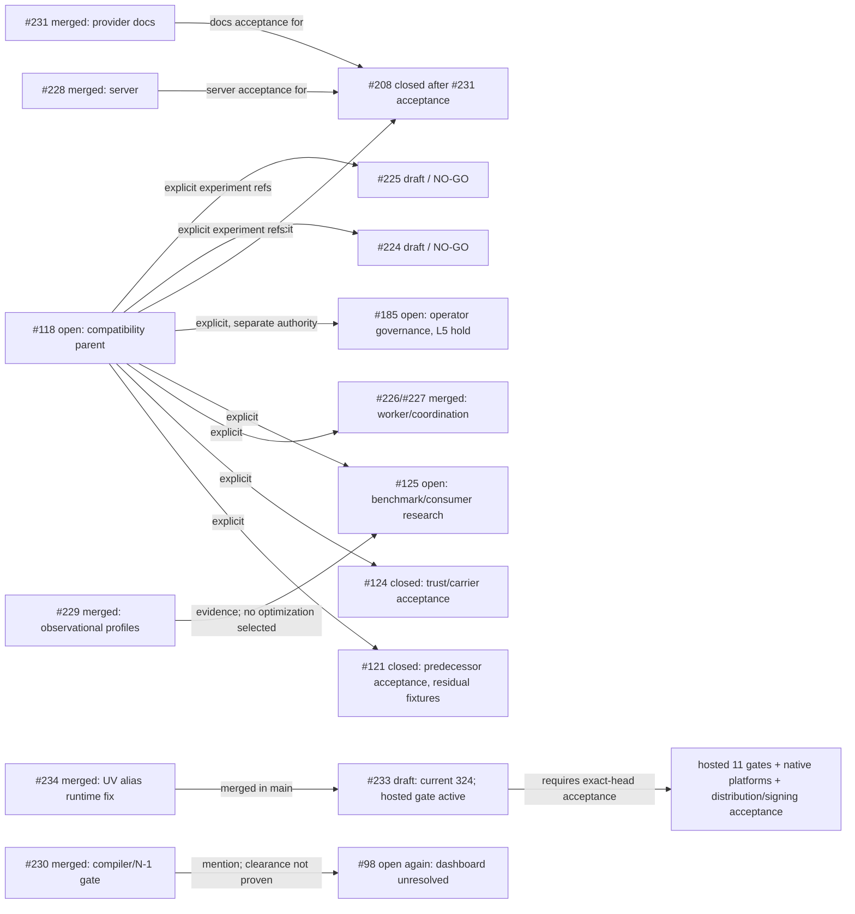

# Live inventory and dependency graph

Public GitHub snapshot: **2026-10-11 01:58:27 UTC**. Main is `07db6221a3540d227f2106eccf69fe0e7c11fee0` / tree `04338ee249398525abcf9ef69b79ee1a072e2c10`; latest stable/release remains v18.19.5. Counts: **10 open issues, 3 open PRs, 67 branches, 33 tags, 27 releases, 0 milestones**. Open issue and PR search returned the sets below. #208 is closed after #231 acceptance; #98 is open again.

## Open issues

| Issue | State and acceptance boundary |
|---|---|
| [#185](https://github.com/joshyorko/rcc/issues/185) | Open, unassigned. Separate operator-governance lane; L5 hold-gated. No agent, test, label, merge, or release promotes authority to L6. |
| [#182](https://github.com/joshyorko/rcc/issues/182) | Open, unassigned. Journal lifecycle and failure-branch coverage remains. |
| [#181](https://github.com/joshyorko/rcc/issues/181) | Open, unassigned. Direct Scale/interleaving/queue-lifecycle tests remain after integrated worker-limit change. |
| [#135](https://github.com/joshyorko/rcc/issues/135) | Open, unassigned. Delta lint is green; original baseline findings need individual disposition. |
| [#133](https://github.com/joshyorko/rcc/issues/133) | Open, unassigned. Contributor setup/build guidance remains stale. |
| [#132](https://github.com/joshyorko/rcc/issues/132) | Open, unassigned. Import-time initialization remains; no explicit bootstrap/DI boundary. |
| [#131](https://github.com/joshyorko/rcc/issues/131) | Open, unassigned. Command/operations error-path tests and durable coverage report remain. |
| [#125](https://github.com/joshyorko/rcc/issues/125) | Open, unassigned. Research only; no materializer optimization selected. Consumer/version evidence was added. |
| [#118](https://github.com/joshyorko/rcc/issues/118) | Open, unassigned. Compatibility parent for #121/#124/#226/#227/#125 with a separate #185 governance boundary. CPU, real Rosetta, ABI timing, native/platform, artifact-carried and path fixture gaps remain. Body refreshed at 01:15Z; provider runtime probe is bound to ancestor 097. |
| [#98](https://github.com/joshyorko/rcc/issues/98) | Open again. Private dependency dashboard returned HTTP 403; alert inventory/clearance remains unverified. Do not infer clearance or bypass access. |

## Open PRs

| PR | Head / state | Live gates |
|---|---|---|
| [#233](https://github.com/joshyorko/rcc/pull/233) | Draft, published head `324524fffa4bd0f76c618f9fbb6ede30e733b2ff`, tree `cfae5c5ee9df0e5031e8e9ae37040b5c98ac6152`, freeze `codex/rcc-integrated-candidate-20261011-hosted-gate`. PR base metadata points at `11155e58…`; root verified prospective merge tree against current main 07db. | Rcc workflow **38103534317** in progress; Coverage **38103534344** passed; CodeQL **38103534328**, PR metrics **38103534368**, Quality **38103534370**, and Lint **38103534384** passed. Contained full release gate **114364186629** is running; Build **114364187148** passed. No current full-gate result. |
| [#224](https://github.com/joshyorko/rcc/pull/224) | Draft / NO-GO, head `32d51bd00852b003fd0d82050f5fd6d281f362d5`, old base `47a60ea…` | Historical exact-head Rcc failed. S3, materializer/CLI, integration, persistence/concurrency and platform acceptance gaps remain. |
| [#225](https://github.com/joshyorko/rcc/pull/225) | Draft / NO-GO, head `b24b29fffab4581456a313a240257d681ad744fd`, old base `47a60ea…` | Historical exact-head Rcc/lint failed. Inode/hardlink, state/concurrency, integration/security and native/full Robot gaps remain. |

Latest stable/release is unchanged. #208 was accepted and closed following #231. #98 remains open following its reopening.

## Current 324 source and active gates

Current source/tree: `324524fffa4bd0f76c618f9fbb6ede30e733b2ff` / `cfae5c5ee9df0e5031e8e9ae37040b5c98ac6152`, frozen branch `codex/rcc-integrated-candidate-20261011-hosted-gate`. Root fetched the published Git object, matched it to the reviewed local tree, and verified that the prospective merge tree against main 07db is identical. The four changed files are `.github/workflows/README.md`, `.github/workflows/rcc.yaml`, `scripts/test_validate_release_topology.py`, and `scripts/validate_release_topology.py`.

Workflow implementation evidence: 23 focused topology tests passed; the actual embedded shell pipeline preserved numeric exits 0, 7 and 10, and receipt-bound metadata outside the checkout passed positive/negative controls. This is implementation validation, not a completed candidate release gate. The PR-triggered Rcc workflow and contained ReleaseCandidateVerification gate remain active; all five auxiliary runs passed. Native Linux/macOS-arm/Windows receipts belong to parent 2de, with Intel pending on that parent. Do not report those as current 324 platform receipts.

## Prior candidate attempts and inherited checks

The local 097 full-gate attempt exited numerically 1 after eight gates passed. Robot was 171 PASS / 0 FAIL / 1 expected Windows skip. SelfHost failed because `GOTOOLCHAIN=local` leaked into a Conda Go 1.26.5 bootstrap that rejected the Go 1.26.9 minimum. goVet and coordination did not run. The subsequent 2de local wrapper did not launch because preflight disk was 6.82 GB, under the 10 GB minimum. Do not rebind either result to 324.

Strict-consumer and security evidence remains ancestor-bound to 097. Strict verification passed four numeric commands, preserved the original padded root/signatures, and rehashed 5,049 actual CAS files against 5,045 indexed objects without mismatches; the refreshed empty revocation snapshot was explicitly unsigned. The four-target default-tag security scan had no call-traced findings. GO-2026-5970 package-level and GO-2026-6629 module-level findings remain. The 17-command provider probe found named-profile setup needs an explicit trust carrier on both candidate and stable controls; unavailable HTTP trust fails closed, while retained filesystem-carrier offline use succeeds with the same policy/evidence. These are not direct 324 checks.

The Actions opt-in version adapter at immutable `joshyorko/actions` commit `a70993fafc99a9f94041485542d5a720797ca394`, adapter SHA-256 `8f7642f4b1ee8ff658dbf2414ec34ca28747054833f73f4996fb4210d9e5dde5`, accepts only RCC v18.19.3; v18.19.5 and v18.19.6 are rejected. This is an existing consumer constraint, not a candidate regression. No Actions repository state changed.

## Dependency graph

## Curated source-bound receipts

| Claim | Receipt | SHA-256 |
|---|---|---|
| Published 324 object/tree and prospective main merge-tree binding; 23 topology tests; shell fixtures 0/7/10 | `evidence/hosted-rc-gate/root-publication-verification.json` | `8c469eac802f8986894dfef9714c6696a54a08ba44fc6916b3c2064bcf46e04b` |
| Workflow shell-exit review and publication boundary | `evidence/hosted-rc-gate/root-independent-workflow-review.json` | `991aa8f8cebdd411eeff13df01ea5862c14d43fa29a49d71efd7e89a28f50489` |
| 2de bundle identity (parent source only) | `evidence/hosted-native/pr233-current-2de5/root-all-eight-and-native-bundle-verification.json` | `48fdef427adbea72071d439dd46a0ea3f46dab792a6ef661631ea27bf743eb44` |
| 2de native progress (parent source only) | `evidence/hosted-native/pr233-current-2de5/root-native-progress-verification.json` | `ce193a5407821871da7aaba4ac76822690a77a292745008a8b18810e258610a2` |
| 097 strict-consumer proof (ancestor-only) | `evidence/candidate-09796/strict-trust/root-independent-verification.json` | `73660999974864783c0087f341bb2d62d069a9666403de0c20ebf661c60fa0c4` |
| 097 provider runtime probe (ancestor-only) | `evidence/consumer-contract-125-20261011/provider-contract-probe/root-independent-verification.json` | `8d44067601f698c6c0044cf98a014620a37e5366d32378a4dff6f4d4dd1ceb51` |

The focused workflow tests and shell fixtures do not replace the active hosted release gate. No full release acceptance, tag, publisher signature, notarization, or release approval is recorded.

## Worker assignments

| Worker | Requested model / effort | Scope and ownership | State |
|---|---|---|---|
| Root | Sol / High orchestration role | Integration, source identity, independent receipt review and merge decisions | Active |
| pr_readiness | Luna / High | Current324 hosted checks and four native bundle/receipt acquisitions | Active |
| native_acceptance | Luna / High | Current324 complete hosted gate, numeric exit and actual binary/archive verification | Active |
| consumer_contract_125 | Sol / Extra High | Consumer evidence complete; read-only118 ABI/platform timing decision research | Active |
| workers_226 | Luna / High | Worker correctness merged; opt-in hosted gate implemented and root reviewed | Complete |
| identity_118_124 | Luna / High | Strict097 trust proof and lossless owned-home preservation | Complete |
| graph_inventory | Luna / High | Live graph and checkpoint drafts | Complete |
| performance_125 | Sol / Extra High | Observational baseline and publication profile; no optimization | Complete |

Models identify the assigned swarm lanes recorded in the prior handoff. No Astra lane was used. Each implementation lane used its own worktree; evidence-only lanes wrote separate directories.
