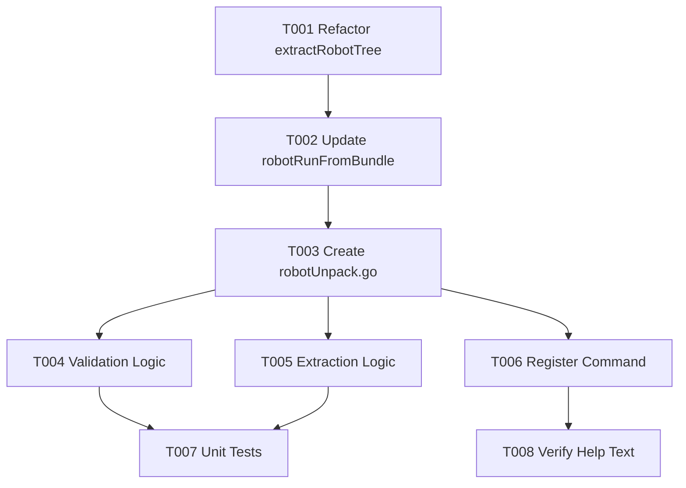

# Tasks: Robot Bundle Unpack

**Feature Branch**: `001-robot-bundle-unpack`
**Spec**: [specs/001-robot-bundle-unpack/spec.md](spec.md)

## Phase 1: Setup
*Goal: Prepare the codebase for the new feature by refactoring existing logic.*

- [x] T001 Create `cmd/bundle_utils.go` and move `extractRobotTree` from `cmd/robotRunFromBundle.go` to it. Verify it handles symlinks as content files (per spec).
- [x] T002 Update `cmd/robotRunFromBundle.go` to use the shared `extractRobotTree` (ensure it still compiles).

## Phase 2: Foundational
*Goal: Establish core components required for all user stories.*

*(No additional foundational tasks required beyond Setup)*

## Phase 3: User Story 1 - Unpack Robot Bundle
*Goal: Implement the `rcc robot unpack` command.*
*Priority: P1*

**Independent Test**:
1. Create a valid robot bundle (zip file with `robot/` directory).
2. Run `rcc robot unpack --bundle mybundle.zip --output ./extracted`.
3. Verify that `./extracted` contains the files from the bundle's `robot/` directory.

- [x] T003 [US1] Create `cmd/robotUnpack.go` with `unpackCmd` struct and flags (`--bundle`, `--output`, `--force`).
- [x] T004 [US1] Implement validation logic in `cmd/robotUnpack.go` (check bundle existence, output dir check).
- [x] T005 [US1] Implement extraction logic in `cmd/robotUnpack.go` using `extractRobotTree`. Ensure it fails fast if `robot/` is missing.
- [x] T006 [US1] Register `unpackCmd` to `robotCmd` in `cmd/robotUnpack.go` `init()` function.
- [x] T007 [US1] Add unit tests for `unpackCmd` in `cmd/robotUnpack_test.go`.

## Phase 4: Polish & Cross-Cutting Concerns
*Goal: Finalize the feature with documentation and verification.*

- [x] T008 Verify help text for `rcc robot unpack` matches specification in `cmd/robotUnpack.go`.

## Dependencies

## Parallel Execution Examples

**User Story 1**:
- T004 (Validation) and T005 (Extraction) can be implemented in parallel after T003 is done.
- T007 (Tests) can be written in parallel with implementation if TDD is used, or after.

## Implementation Strategy
1.  **Refactor First**: Ensure `extractRobotTree` is reusable without breaking existing functionality.
2.  **Skeleton**: Create the command structure.
3.  **Logic**: Fill in the validation and extraction logic.
4.  **Verify**: Test with actual bundles.
